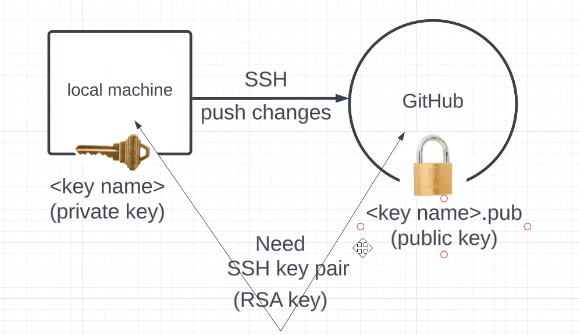
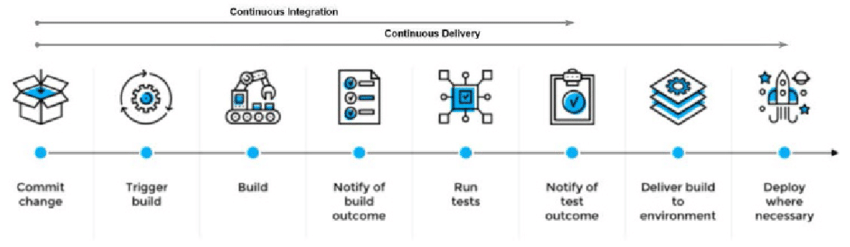

## SSH-keys
* Want to push changes from local machine to github
* Secure version of http is https
* Want to change the protocol from https to ssh
* SSH is more secure 
* Authentication -> checking if youre allowed to carry out the action
* Can be authenticated with a username and password
* Can't use username and password with automation
* Can use keys
* Can use personel access token (it's a long string)
* Benefit of using SSH is that it uses keys, and keys are much longer -> makes it more secure
* Have to store key in secure place
* When the key is passed, it must be encrypted to protect the data
* Key's help with automation because once it is registered in the right place it will authenticate automatically.
* Want to push changes to github with ssh instead of HTTPS, need key pair for that
* Will use RSA key encryption
## Using SSH keys with github
1) Create SSH key pair, with RSA type
* Open gitbash
* Cd into .ssh
* Generate key : 
```
ssh-keygen -t rsa -b 4096 -C "email"
```
* Can use any email, doesn't have to be github email 
* Enter file into which youd like to save the key e.g:` github-key`
* Creates 2 files, one regular and one .pub
* 2 parts to RSA key -> padlock/public key and key/ private key
* Can keep the `.pub` public, its called a `public key`
* Keep the other key private, this is the `private key`
* Assymetric encryption system -> because theres a key pair, they are mathematically generated.
* Can generate a `public key` from the `private key`, cant generate a `private key` from the `public key`
* Symmetrical encryption - one key
* Will have to register public key on github
* On github its called an authentication key
* Encryption isn't relient on key, SSH is automatically encrypted
2) Add/register key on github account -> do this with public key
* Open gitbuh
* Click on your profile picture in the top right corner, and select settings
* Click `SSH and GPG keys`
* Name your key
* Go into gitbash, print you public key with `cat`
* Copy the entire key, email included
* Paste it into the box
* Click add key
* Confirm with password and 2-factor authentication if needed.
* So far we have registered the public key with github
3) Add private key to ssh private key list
* Need to start ssh-agent:
```
eval `ssh-agent -s`
```
* Displayes the process ID
* Run:
``` 
ssh-add github-key
```
* Should output identity added, followed by email address
* Test if the key registered by ssh is used to authenticate to github:
```
ssh -T git@github.com
```
* Will now automatically use private key to automatically authenticate to github
4) Create test repository on github
5) Push changes to github using SSH key
* `git init` creates a hidden folder with hidden files -> initialises your working directory as a git directory
* The hidden folders do the following:
* Keep track of `commits`
* Keep track of `staging`
* `git add` adding it to staging -> git starts tracking files
* `git status` - shows what files are staged and committed.
* `git commit -m "message"` - readies the staged files for pushing
* `git branch -M main`- create a branch called `main`
* `git remote add origin git@github.com:gitrepo` - specifies the path to a selected remote repository
* `git push -u origin main` - pushes changes to the repository
* ` 
* Origin - where it comes from
* Specifying the ssh version of where the repository is remotely
* Once a key has been registered, its put in its own secure location.
* Even if the `private key` is moved around, it should still work
* Protocol is like a language used to push changes
* HTTPS and SSH both secure
* Once you've pushed your changes to any branch, dont need to specify the branch, pushes will default to the most recently used branch



## Switching back to HTTPS
* `git remote remove origin`
* `git remote add origin https_link`
## SSH vs HTTPS
* SSH is more secure
* Once SSH is registered, dont have to enter it again, therefore good for automation
## Potential issues -> permission denied
* If you open another gitbash terminal and try to push your changes from there while the original terminal is open, it will not work. You will be denied permission, so ensure that you only attempt to push changes from the terminal where you used 
```
eval `ssh-agent -s`
```
and
```
ssh-add github-key
```
* If you are unsure whether you have permissions in your current terminal, run :
```
ssh -T git@github.com
```
## CI/CD
* Use Jenkings because its open source -> its an automation server
* Used by many people and billion dollar companies
* Webhook trigger (24/7 listens for changes from local host, if change is detected it sends a notification), technically an API 
* Anything created in jenkins is a job/task
* Continuous delivery -> 
* Continuous deployment->
* Build 1 block test
* Build second block test
* Connect blocks test
## Continuous integration
* Continuous integration is the practice of frequantly merging new code changes into a central repository, so that automated building and testing can be done.
* Changes in code are committed to a central repository using a version control system like git.
* Under CI, builds and tests are ran automatically
* Every code revision triggers an automated build and test stage, 
### Why do continuous integration
* `Find bugs quicker`- By merging in frequent intervals, bugs do not accumulate, and so they are easier to detect and fix
* `Improve developer productivity`-  Continuous integration helps your team be more productive by freeing developers from manual tasks and encouraging behaviors that help reduce the number of errors and bugs released to customers
* `Deliver updates faster` - Continuous integration helps your team deliver updates to their customers faster and more frequently
## Continuous delivery and deployment
* Code changes are automatically prepared for release into a production environment
* All code changes are deployed to a testing environment, and if the tests are passed to a production environment 
* Continuous delivery automates the entire software release process. Every revision that is committed triggers an automated flow that builds, tests, and then stages the update. The final decision to deploy to a live production environment is triggered by the developer
* Under continuous deployment, the entire process is automated, meaning that if the tests are passed, the software package is automatically deployed onto the production environent, without human intervention
### Why use continuous delivery or deployment
* `Automate the software release process` - Continuous delivery lets your team automatically build, test, and prepare code changes for release to production so that your software delivery is more efficient and rapid
* `Improve developer productivity` - These practices help your team be more productive by freeing developers from manual tasks and encouraging behaviors that help reduce the number of errors and bugs deployed to customers
* `Find and address bugs quicker`- Your team can discover and address bugs earlier before they grow into larger problems later with more frequent and comprehensive testing. Continuous delivery lets you more easily perform additional types of tests on your code because the entire process has been automated.
* `Deliver updates faster` - Continuous delivery helps your team deliver updates to customers faster and more frequently. When continuous delivery is implemented properly, you will always have a deployment-ready build artifact that has passed through a standardized test process.



## What is Jenkins
* Jenkins is an open source continuous integration/continuous delivery and deployment (CI/CD) automation software DevOps tool written in the Java programming language. It is used to implement CI/CD workflows, called pipelines
* Pipelines automate testing and reporting on isolated changes in a larger code base in real time and facilitates the integration of disparate branches of the code into a main branch
* They also rapidly detect defects in a code base, build the software, automate testing of their builds, prepare the code base for deployment (delivery), and ultimately deploy code to containers and virtual machines, as well as bare metal and cloud servers
* Jenkins Pipeline (or simply "Pipeline") is a suite of plugins which supports implementing and integrating continuous delivery pipelines into Jenkins
* A continuous delivery pipeline is an automated expression of your process for getting software from version control right through to your users and customers
* Jenkins Pipeline provides an extensible set of tools for modeling simple-to-complex delivery pipelines "as code"
### Why Jenkins
* It is an open-source tool with great community support.
* It is easy to install.
* It has 1000+ plugins to ease your work. If a plugin does not exist, you can code it and share it with the community.
* It is free of cost.
* It is built with Java and hence, it is portable to all the major platforms.
## Examples of other automation software
* `Bamboo` - Bamboo is a CI and CD server that is used to automate the release management for software applications, providing a continuous delivery pipeline. The tool schedules and coordinates the work involved in building and testing. Bamboo is an Atlassian product, and can be integrated with many of the company’s tools, such as Jira Software, Fisheye, and Bitbucket. It can also be customized with tons of features and add-ons that can be found at the Atlassian Marketplace (for example, it is possible to get a plugin for Slack
* `TeamCity` - TeamCity is a Java-based build management and continuous integration server for developers and build engineers. TeamCity is made by JetBrains, the same producer of Intellij Idea, Pycharm, and Android Studio. It has some platform specific features such as running code coverage and a duplicates finder for Java and NET, in addition to being able to customize statistics on build duration, success rate, code quality, and custom metrics.
## Git workflow
* A Git workflow is a recipe or recommendation for how to use Git to accomplish work in a consistent and productive manner
1) Initialize the central repository
2) Clone the central repository
3) Make changes on your local machine
4) Stage and commit the changes
5) Push new commits to central repository

