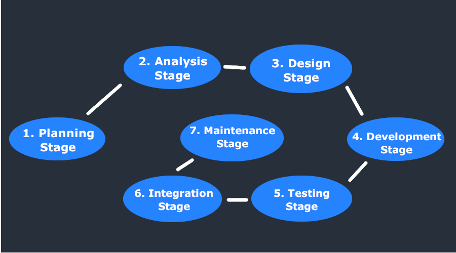
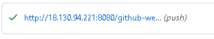
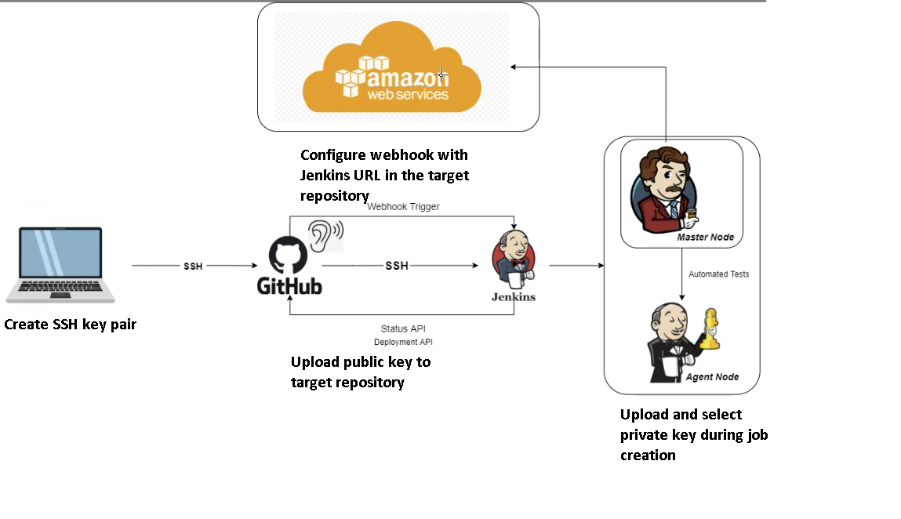
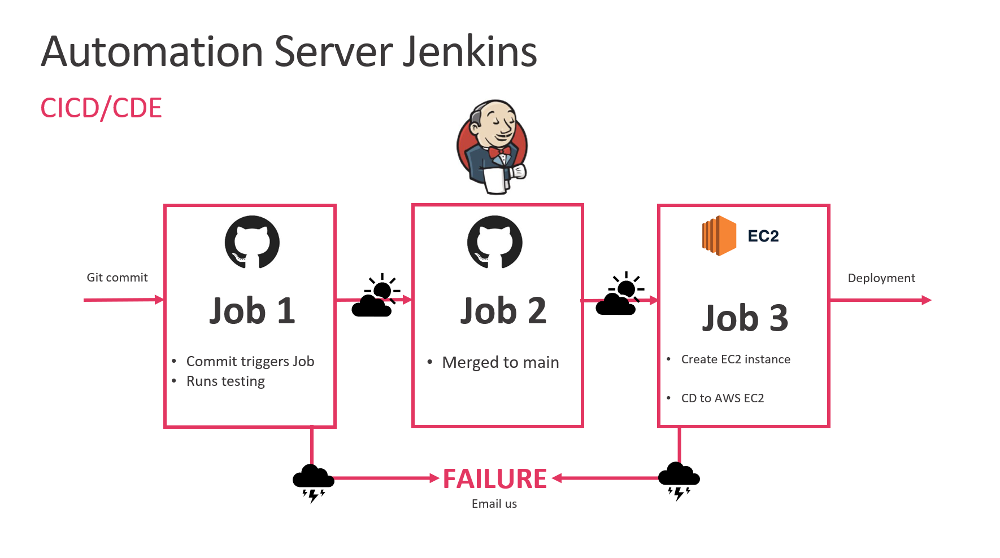

## SSH-keys
* Want to push changes from local machine to github
* Secure version of http is https
* Want to change the protocol from https to ssh
* SSH is more secure 
* Authentication -> checking if youre allowed to carry out the action
* Can be authenticated with a username and password
* Can't use username and password with automation
* Can use keys
* Can use personel access token (it's a long string)
* Benefit of using SSH is that it uses keys, and keys are much longer -> makes it more secure
* Have to store key in secure place
* When the key is passed, it must be encrypted to protect the data
* Key's help with automation because once it is registered in the right place it will authenticate automatically.
* Want to push changes to github with ssh instead of HTTPS, need key pair for that
* Will use RSA key encryption
## Using SSH keys with github
1) Create SSH key pair, with RSA type
* Open gitbash
* Cd into .ssh
* Generate key : 
```
ssh-keygen -t rsa -b 4096 -C "email"
```
* Can use any email, doesn't have to be github email 
* Enter file into which youd like to save the key e.g:` github-key`
* Creates 2 files, one regular and one .pub
* 2 parts to RSA key -> padlock/public key and key/ private key
* Can keep the `.pub` public, its called a `public key`
* Keep the other key private, this is the `private key`
* Assymetric encryption system -> because theres a key pair, they are mathematically generated.
* Can generate a `public key` from the `private key`, cant generate a `private key` from the `public key`
* Symmetrical encryption - one key
* Will have to register public key on github
* On github its called an authentication key
* Encryption isn't relient on key, SSH is automatically encrypted
2) Add/register key on github account -> do this with public key
* Open gitbuh
* Click on your profile picture in the top right corner, and select settings
* Click `SSH and GPG keys`
* Name your key
* Go into gitbash, print you public key with `cat`
* Copy the entire key, email included
* Paste it into the box
* Click add key
* Confirm with password and 2-factor authentication if needed.
* So far we have registered the public key with github
3) Add private key to ssh private key list
* Need to start ssh-agent:
```
eval `ssh-agent -s`
```
* Displayes the process ID
* Run:
``` 
ssh-add github-key
```
* Should output identity added, followed by email address
* Test if the key registered by ssh is used to authenticate to github:
```
ssh -T git@github.com
```
* Will now automatically use private key to automatically authenticate to github
4) Create test repository on github
5) Push changes to github using SSH key
* `git init` creates a hidden folder with hidden files -> initialises your working directory as a git directory
* The hidden folders do the following:
* Keep track of `commits`
* Keep track of `staging`
* `git add` adding it to staging -> git starts tracking files
* `git status` - shows what files are staged and committed.
* `git commit -m "message"` - readies the staged files for pushing
* `git branch -M main`- create a branch called `main`
* `git remote add origin git@github.com:gitrepo` - specifies the path to a selected remote repository
* `git push -u origin main` - pushes changes to the repository
* ` 
* Origin - where it comes from
* Specifying the ssh version of where the repository is remotely
* Once a key has been registered, its put in its own secure location.
* Even if the `private key` is moved around, it should still work
* Protocol is like a language used to push changes
* HTTPS and SSH both secure
* Once you've pushed your changes to any branch, dont need to specify the branch, pushes will default to the most recently used branch


## Switching back to HTTPS
* `git remote remove origin`
* `git remote add origin https_link`
## SSH vs HTTPS
* SSH is more secure
* Once SSH is registered, dont have to enter it again, therefore good for automation
## Potential issues -> permission denied
* If you open another gitbash terminal and try to push your changes from there while the original terminal is open, it will not work. You will be denied permission, so ensure that you only attempt to push changes from the terminal where you used 
```
eval `ssh-agent -s`
```
and
```
ssh-add github-key
```
* If you are unsure whether you have permissions in your current terminal, run :
```
ssh -T git@github.com
```
## CI/CD
* Use Jenkings because its open source -> its an automation server
* Used by many people and billion dollar companies
* Webhook trigger (24/7 listens for changes from local host, if change is detected it sends a notification), technically an API 
* Anything created in jenkins is a job/task
* Continuous delivery -> 
* Continuous deployment->
* Build 1 block test
* Build second block test
* Connect blocks test
## Continuous integration
* Continuous integration is the practice of frequantly merging new code changes into a central repository, so that automated building and testing can be done.
* Changes in code are committed to a central repository using a version control system like git.
* Under CI, builds and tests are ran automatically
* Every code revision triggers an automated build and test stage, 
### Why do continuous integration
* `Find bugs quicker`- By merging in frequent intervals, bugs do not accumulate, and so they are easier to detect and fix
* `Improve developer productivity`-  Continuous integration helps your team be more productive by freeing developers from manual tasks and encouraging behaviors that help reduce the number of errors and bugs released to customers
* `Deliver updates faster` - Continuous integration helps your team deliver updates to their customers faster and more frequently
## Continuous delivery and deployment
* Code changes are automatically prepared for release into a production environment
* All code changes are deployed to a testing environment, and if the tests are passed to a production environment 
* Continuous delivery automates the entire software release process. Every revision that is committed triggers an automated flow that builds, tests, and then stages the update. The final decision to deploy to a live production environment is triggered by the developer
* Under continuous deployment, the entire process is automated, meaning that if the tests are passed, the software package is automatically deployed onto the production environent, without human intervention
### Why use continuous delivery or deployment
* `Automate the software release process` - Continuous delivery lets your team automatically build, test, and prepare code changes for release to production so that your software delivery is more efficient and rapid
* `Improve developer productivity` - These practices help your team be more productive by freeing developers from manual tasks and encouraging behaviors that help reduce the number of errors and bugs deployed to customers
* `Find and address bugs quicker`- Your team can discover and address bugs earlier before they grow into larger problems later with more frequent and comprehensive testing. Continuous delivery lets you more easily perform additional types of tests on your code because the entire process has been automated.
* `Deliver updates faster` - Continuous delivery helps your team deliver updates to customers faster and more frequently. When continuous delivery is implemented properly, you will always have a deployment-ready build artifact that has passed through a standardized test process.


## What is Jenkins
* Jenkins is an open source continuous integration/continuous delivery and deployment (CI/CD) automation software DevOps tool written in the Java programming language. It is used to implement CI/CD workflows, called pipelines
* Pipelines automate testing and reporting on isolated changes in a larger code base in real time and facilitates the integration of disparate branches of the code into a main branch
* They also rapidly detect defects in a code base, build the software, automate testing of their builds, prepare the code base for deployment (delivery), and ultimately deploy code to containers and virtual machines, as well as bare metal and cloud servers
* Jenkins Pipeline (or simply "Pipeline") is a suite of plugins which supports implementing and integrating continuous delivery pipelines into Jenkins
* A continuous delivery pipeline is an automated expression of your process for getting software from version control right through to your users and customers
* Jenkins Pipeline provides an extensible set of tools for modeling simple-to-complex delivery pipelines "as code"
### Why Jenkins
* It is an open-source tool with great community support.
* It is easy to install.
* It has 1000+ plugins to ease your work. If a plugin does not exist, you can code it and share it with the community.
* It is free of cost.
* It is built with Java and hence, it is portable to all the major platforms.
## Examples of other automation software
* `Bamboo` - Bamboo is a CI and CD server that is used to automate the release management for software applications, providing a continuous delivery pipeline. The tool schedules and coordinates the work involved in building and testing. Bamboo is an Atlassian product, and can be integrated with many of the company’s tools, such as Jira Software, Fisheye, and Bitbucket. It can also be customized with tons of features and add-ons that can be found at the Atlassian Marketplace (for example, it is possible to get a plugin for Slack
* `TeamCity` - TeamCity is a Java-based build management and continuous integration server for developers and build engineers. TeamCity is made by JetBrains, the same producer of Intellij Idea, Pycharm, and Android Studio. It has some platform specific features such as running code coverage and a duplicates finder for Java and NET, in addition to being able to customize statistics on build duration, success rate, code quality, and custom metrics.
* ` 
## Git workflow
* A Git workflow is a recipe or recommendation for how to use Git to accomplish work in a consistent and productive manner
1) Initialize the central repository
2) Clone the central repository
3) Make changes on your local machine
4) Stage and commit the changes
5) Push new commits to central repository


## Jenkins workflow


* Changes to the code repository are made, and Jenkins is notified via a webhook
* Changes are pushed to Jenkins master node
* The Jenkins master node pushes the target code block to an agent node (can be several agent nodes) for automated testing
* Agent nodes test and build the code block, sending the results back to the master node
* If the tests are passed, the master node may either prime the new block for being pushed to the production environment (Continuous delivery) or deploy it immediately (Continuous deployment).
* If a test is failed, the relevant developers are notified
* Either way, the next change will then be primed for the same, continuous and autonomous process

## Software Development Life Cycle (SDLC) workflow
1) Planning Stage
2) Feasibility or Requirements of Analysis Stage
3) Design and Prototyping Stage
4) Software Development Stage
5) Software Testing Stage
6) Implementation and Integration
7) Operations and Maintenance Stage



### Planning stage
* Phase in which developers will plan for the upcoming project.
* It helps to define the problem and scope of any existing systems, as well as determine the objectives for their new systems.
* By developing an effective outline for the upcoming development cycle, they'll theoretically catch problems before they affect development.
* And help to secure the funding and resources they need to make their plan happen.
* Perhaps most importantly, the planning stage sets the project schedule, which can be of key importance if development is for a commercial product that must be sent to market by a certain time
### Feasibility or requirements of Analysis stage
* The analysis stage includes gathering all the specific details required for a new system as well as determining the first ideas for prototypes.Developers may:
* Define any prototype system requirements
* Evaluate alternatives to existing prototypes
* Perform research and analysis to determine the needs of end-users

Furthermore, developers will often create a software requirement specification or SRS document.
This includes all the specifications for software, hardware, and network requirements for the system they plan to build. This will prevent them from overdrawing funding or resources when working at the same place as other development teams.
### Design and Prototyping Stage
* The design stage is a necessary precursor to the main developer stage.
* Developers will first outline the details for the overall application, alongside specific aspects, such as its:
* User interfaces
* System interfaces
* Network and network requirements
* Databases

They’ll typically turn the SRS document they created into a more logical structure that can later be implemented in a programming language. Operation, training, and maintenance plans will all be drawn up so that developers know what they need to do throughout every stage of the cycle moving forward. Once complete, development managers will prepare a design document to be referenced throughout the next phases of the SDLC
### Development Stage
* The development stage is the part where developers actually write code and build the application according to the earlier design documents and outlined specifications.
* This is where Static Application Security Testing or SAST tools come into play.
* Product program code is built per the design document specifications. In theory, all of the prior planning and outlined should make the actual development phase relatively straightforward.
* Developers will follow any coding guidelines as defined by the organization and utilize different tools such as compilers, debuggers, and interpreters.
* Programming languages can include staples such as C++, PHP, and more. Developers will choose the right programming code to use based on the project specifications and requirements
### Testing stage
* Building software is not the end.
* Now it must be tested to make sure that there aren’t any bugs and that the end-user experience will not negatively be affected at any point.
* During the testing stage, developers will go over their software with a fine-tooth comb, noting any bugs or defects that need to be tracked, fixed, and later retested.
* It’s important that the software overall ends up meeting the quality standards that were previously defined in the SRS document.
### Implementation and Integration Stage
* After testing, the overall design for the software will come together. Different modules or designs will be integrated into the primary source code through developer efforts, usually by leveraging training environments to detect further errors or defects.
* The information system will be integrated into its environment and eventually installed. After passing this stage, the software is theoretically ready for market and may be provided to any end-users.
### Maintenance stage
* The SDLC doesn’t end when software reaches the market. Developers must now move into a maintenance mode and begin practicing any activities required to handle issues reported by end-users.
* Furthermore, developers are responsible for implementing any changes that the software might need after deployment.
* This can include handling residual bugs that were not able to be patched before launch or resolving new issues that crop up due to user reports. Larger systems may require longer maintenance stages compared to smaller systems.
## Jenkins
1) Generate ssh keypair in .ssh folder
2) Copy benas_jenkins.pub to Github repo with app folder
3) Copy benas_jenkins key to Jenkins
4) Build a Jenkins job with the repo - trigger the job
* Run on agent node so that if it
## Creating a link between a Github repository and Jenkins- Configure github
1) Create SSH key pair, with RSA type
* Open gitbash
* Cd into .ssh
* Generate key : 
```
ssh-keygen -t rsa -b 4096 -C "email"
```
* Can use any email, doesn't have to be github email 
* Enter file into which youd like to save the key e.g:`name_jenkins`
* Can skip over the password, just press `ENTER`
* Creates 2 files, one regular and one .pub
2) Open the repository with your app folder
3) Press `Settings` -> `Deploy keys`
4) On gitbash, in your .ssh folder type `cat file_name.pub` and copy the **FULL** output
5) On github, click `Add deploy key`
6) Name the key, with the same name as your file
7) Paste the key into the `Key` box
8) Click `Add key`
## Creating a link between a Github repository and Jenkins- Configure jenkins - job 1
1) Log in to Jenkins
2) Click `New Item`
3) Create a `Freestyle` job
4) Optionally add a description, e.g. test CI, github https, ssh key
5) Tick `Discard old builds`
6) `Max # of builds to keep` enter 3
7) Tick `Github project`
8) Enter the https address of your selected repository
9) Under `Source Code Management`, select `Git`
10) Enter your `SSH repository address`
11) Click `Add`
12) Click `Jenkins`
13) Under `Kind`, select `SSH Username with private key`
14) Name the key in `Description`, e.g name_jenkins
15) Click `Add`
16) In your `gitbash` terminal, in the `.ssh` folder, print your private key using `cat file_name`
17) Copy the whole key (beginning of key and ending of key included)
18) Paste the key into Jenkins
19) Click `Add`
20) Under `Build Triggers`, select `GitHub hook trigger GITScm polling`
21) Under `Build Environment`, select `Provide Node & npm bin/folder PATH`
22) Enter your `NodeJS Installation`, for me it is sparta-node-js
23) Under `Build`, select `Execute shell`
24) Enter the following commands:
```
cd app
npm install 
npm test
```
## Adding a webhook to automate pushes from local host to jenkins
1) Copy the raw Jenkins url for your prject, **WITHOUT** the directories: e.g. `http://18.130.94.221:8080/`
2) Open you github repository
3) Click `Settings` -> `Webhooks` -> `Add webhook`
4) In the `Payload URL`, paste in the jenkins address
5) Add `/github-webhook/` on to the end of it, so the final address may look like this : `http://18.130.94.221:8080/github-webhook/`
6) For `Content type`, select `application/json`
7) Select `Just the push event`
8) Tick the `Active` box`
9) Click `Add webhook`
10) If done correctly, it should look like this :



11) Now go back to your `Jenkins` page
12) Click `Apply`
13) Click `Save`
14) You can now click `Build Now` to run the project
15) If it runs correctly, you should see the following next to your project name:


16) Now, any changes which you push from the tracked repository from your local host, will be aotomatically pushed to Jenkins and ran. With this tutorial we have achieved the `continuous integration` of our code



## Additional notes
* Testing and building is done in the agent node, so that if the tests break the environment, the master node remains intact, therefore maintaining a valid pathway to the production environment
## Creating a full CI/CD pipeline on jenkins
1) Create a dev branch on gitbash:
```
git checkout -b "dev"
```
2) Make a job on Jenkins which tests the app in your dev branch
3) Create another job which merges the dev branch with the main branch
4) In the post build actions of the first job, enable the 2nd job to run if the first is successfull
5) Create an EC2 instance
5) Create a 3rd job which pushes the merged main branch to EC2 instance
* Upload .pem file to Jenkins

rsync -avz -e "ssh -o StrictHostKeyChecking=no" app ubuntu@3.250.138.198:/home/ubuntu
rsync -avz -e "ssh -o StrictHostKeyChecking=no" environment ubuntu@3.250.138.198:/home/ubuntu
ssh -o "StrictHostKeyChecking=no" ubuntu@3.250.138.198 <<EOF
 
EOF


scp -v -r -o StrictHostKeyChecking=no app/ ubuntu@52.212.201.239:/home/ubuntu/

## Setting up a CI/CDe pipeline using Jenkins - Job 2
1) Click `New Item`
3) Create a `Freestyle` job
4) Optionally add a description, e.g. tes CI, github https, ssh key
5) Tick `Discard old builds`
6) `Max # of builds to keep` enter 3
7) Tick `Github project`
8) Enter the https address of your selected repository
9) Under `Source Code Management`, select `Git`
10) Enter your `SSH repository address`
11) Select your `SSH key`
12) Set branch specifier do `*/dev`
13) Under `Build Triggers`, select `GitHub hook trigger GITScm polling`
14) Under `Build Environment`, select `Provide Node & npm bin/folder PATH`
15) Enter your `NodeJS Installation`, for me it is sparta-node-js
16) Under `Post-build Actions`, select `Build other projects`
17) Enter your job 3 name
18) Select `Trigger only if build is stable`
19) Still under `Post-build Actions`, select `Git Publisher`
20) Tick `Push Only if Build Succeeds`
21) Tick `Merge Results`
22) Tick `Force Push`
23) Under `Branches`, `Branch to push` enter `main`
24) Under `Brancehs`, `Target remote name` enter `origin`
25) Click `Apply` and `Save`
## Setting up a CI/CDe pipeline using Jenkins - Job 3
**Note- Before starting this job you need to set up an EC2 instance"
1) Click `New Item`
3) Create a `Freestyle` job
4) Optionally add a description, e.g. tes CI, github https, ssh key
5) Tick `Discard old builds`
6) `Max # of builds to keep` enter 3
7) Tick `Github project`
8) Enter the https address of your selected repository
9) Under `Source Code Management`, select `Git`
10) Enter your `SSH repository address`
11) Select your `SSH key`
12) Set branch specifier do `*/main`
13) Under `Build Triggers`, select `GitHub hook trigger GITScm polling`
14) Under `Build Environment`, select `Provide Node & npm bin/folder PATH`
15) Under `Build environment`, select `SSH Agent` and enter your .pem file key that you use to connect to Amazon EC2
15) Enter your `NodeJS Installation`, for me it is sparta-node-js
16) Under `Build`, select Execute shell
17) Enter the following code:
```
scp -v -r -o StrictHostKeyChecking=no app/ ubuntu@<ipv4 public 1p>:/home/ubuntu/
ssh -A -o StrictHostKeyChecking=no ubuntu@<ipv4 public ip> <<EOF

cd app
npm install
pm2 kill
nohup npm start 2>/dev/null 1>/dev/null&
```
* Or you can run :
```
rsync -avz -e "ssh -o StrictHostKeyChecking=no" app ubuntu@<ipv4 public ip>:/home/ubuntu
ssh -o "StrictHostKeyChecking=no" ubuntu@<ipv4 public ip> <<EOF
    sudo bash ./app/provision.sh
    cd app
    npm install
    nohup npm start 2>/dev/null 1>/dev/null&

EOF
```

